<!-- Generated by scripts/gen-doc-graphs.ts - do not edit by hand.
     Run `pnpm run gen-doc-graphs` to regenerate. -->

# DSH Base Composition

The dsh-base bundle patch shared by the web, headless, sdk, and acp profiles; their mode bundles and user layers patch over it, while sdk-minimal owns a separate standalone tree.

```mermaid
flowchart LR
  cfg["packages/bundle/base/cordis.patch.yml<br/>cordis.yml"]
  plugin_dsh_base_plugin_manager["plugin-manager<br/>@deepseek-ai/dsh-plugin-manager"]
  cfg --> plugin_dsh_base_plugin_manager
  plugin_dsh_base_timer["timer<br/>@deepseek-ai/cordis-plugin-timer"]
  cfg --> plugin_dsh_base_timer
  plugin_dsh_base_hmr["hmr<br/>@deepseek-ai/dsh-hmr"]
  cfg --> plugin_dsh_base_hmr
  plugin_dsh_base_llm["llm<br/>@deepseek-ai/dsh-llm"]
  cfg --> plugin_dsh_base_llm
  plugin_dsh_base_session["session<br/>@deepseek-ai/dsh-session"]
  cfg --> plugin_dsh_base_session
  plugin_dsh_base_typert["typert<br/>@deepseek-ai/dsh-typert-registry"]
  cfg --> plugin_dsh_base_typert
  plugin_dsh_base_typert_loader["typert-loader<br/>@deepseek-ai/dsh-typert-loader"]
  cfg --> plugin_dsh_base_typert_loader
  plugin_dsh_base_typert_gateway["typert-gateway<br/>@deepseek-ai/dsh-api-gateway"]
  cfg --> plugin_dsh_base_typert_gateway
  plugin_dsh_base_session_title["session-title<br/>@deepseek-ai/dsh-session-title"]
  cfg --> plugin_dsh_base_session_title
  plugin_dsh_base_session_title_llm["session-title-llm<br/>@deepseek-ai/dsh-session-title-first-prompt-llm"]
  cfg --> plugin_dsh_base_session_title_llm
  plugin_dsh_base_user_questions["user-questions<br/>@deepseek-ai/dsh-user-questions"]
  cfg --> plugin_dsh_base_user_questions
  plugin_dsh_base_agent["agent<br/>@deepseek-ai/dsh-agent"]
  cfg --> plugin_dsh_base_agent
  plugin_dsh_base_agent_default_model["agent-default-model<br/>@deepseek-ai/dsh-agent-default-model"]
  cfg --> plugin_dsh_base_agent_default_model
  plugin_dsh_base_llm_retry["llm-retry<br/>@deepseek-ai/dsh-llm-retry"]
  cfg --> plugin_dsh_base_llm_retry
  plugin_dsh_base_config_editor["config-editor<br/>@deepseek-ai/dsh-config-editor"]
  cfg --> plugin_dsh_base_config_editor
  plugin_dsh_base_settings["settings<br/>@deepseek-ai/dsh-settings"]
  cfg --> plugin_dsh_base_settings
  plugin_dsh_base_authorization["authorization<br/>@deepseek-ai/dsh-authorization"]
  cfg --> plugin_dsh_base_authorization
  plugin_dsh_base_credentials["credentials<br/>@deepseek-ai/dsh-credentials-local"]
  cfg --> plugin_dsh_base_credentials
  plugin_dsh_base_llm_pi_ai["llm-pi-ai<br/>@deepseek-ai/dsh-llm-pi-ai"]
  cfg --> plugin_dsh_base_llm_pi_ai
  plugin_dsh_base_session_persistence_jsonl["session-persistence-jsonl<br/>@deepseek-ai/dsh-session-persistence-jsonl"]
  cfg --> plugin_dsh_base_session_persistence_jsonl
  plugin_dsh_base_attachment_local["attachment-local<br/>@deepseek-ai/dsh-attachment-local"]
  cfg --> plugin_dsh_base_attachment_local
  plugin_dsh_base_session_query_sqlite["session-query-sqlite<br/>@deepseek-ai/dsh-session-query-sqlite"]
  cfg --> plugin_dsh_base_session_query_sqlite
  plugin_dsh_base_session_projection["session-projection<br/>@deepseek-ai/dsh-session-projection"]
  cfg --> plugin_dsh_base_session_projection
  plugin_dsh_base_storage["storage<br/>@deepseek-ai/dsh-storage"]
  cfg --> plugin_dsh_base_storage
  plugin_dsh_base_storage_json["storage-json<br/>@deepseek-ai/dsh-storage-json"]
  cfg --> plugin_dsh_base_storage_json
  plugin_dsh_base_storage_domain["storage-domain<br/>@deepseek-ai/dsh-storage-domain"]
  cfg --> plugin_dsh_base_storage_domain
  plugin_dsh_base_session_projection_cache["session-projection-cache<br/>@deepseek-ai/dsh-session-projection-cache"]
  cfg --> plugin_dsh_base_session_projection_cache
  plugin_dsh_base_sandbox_policy["sandbox-policy<br/>@deepseek-ai/dsh-sandbox-policy"]
  cfg --> plugin_dsh_base_sandbox_policy
  plugin_dsh_base_approval["approval<br/>@deepseek-ai/dsh-user-approval"]
  cfg --> plugin_dsh_base_approval
  plugin_dsh_base_commands["commands<br/>@deepseek-ai/dsh-commands"]
  cfg --> plugin_dsh_base_commands
  plugin_dsh_base_command_feedback["command-feedback<br/>@deepseek-ai/dsh-command-feedback"]
  cfg --> plugin_dsh_base_command_feedback
  plugin_dsh_base_token_meter["token-meter<br/>@deepseek-ai/dsh-token-meter"]
  cfg --> plugin_dsh_base_token_meter
  plugin_dsh_base_timeout_policy["timeout-policy<br/>@deepseek-ai/dsh-tool-call-timeout-policy"]
  cfg --> plugin_dsh_base_timeout_policy
  plugin_dsh_base_spill_local["spill-local<br/>@deepseek-ai/dsh-spill-local"]
  cfg --> plugin_dsh_base_spill_local
  plugin_dsh_base_spill_policy["spill-policy<br/>@deepseek-ai/dsh-spill-policy"]
  cfg --> plugin_dsh_base_spill_policy
  plugin_dsh_base_session_checkpoint_policy["session-checkpoint-policy<br/>@deepseek-ai/dsh-session-checkpoint-policy"]
  cfg --> plugin_dsh_base_session_checkpoint_policy
  plugin_dsh_base_image_offload["image-offload<br/>@deepseek-ai/dsh-compaction-image-offload"]
  cfg --> plugin_dsh_base_image_offload
  plugin_dsh_base_repeat_tool_reminder["repeat-tool-reminder<br/>@deepseek-ai/dsh-repeat-tool-reminder"]
  cfg --> plugin_dsh_base_repeat_tool_reminder
  plugin_dsh_base_mcp_resources["mcp-resources<br/>@deepseek-ai/dsh-mcp-resources"]
  cfg --> plugin_dsh_base_mcp_resources
  plugin_dsh_base_tools["tools<br/>@deepseek-ai/dsh-tools"]
  cfg --> plugin_dsh_base_tools
  plugin_dsh_base_system_prompt["system-prompt<br/>@deepseek-ai/dsh-system-prompt"]
  cfg --> plugin_dsh_base_system_prompt
  plugin_dsh_base_agent_loop["agent-loop<br/>@deepseek-ai/dsh-agent-loop"]
  cfg --> plugin_dsh_base_agent_loop
  plugin_dsh_base_fs_sandbox["fs-sandbox<br/>@deepseek-ai/dsh-fs-sandbox"]
  cfg --> plugin_dsh_base_fs_sandbox
```

| Plugin id | Package / module |
| --- | --- |
| `plugin-manager` | `@deepseek-ai/dsh-plugin-manager` |
| `timer` | `@deepseek-ai/cordis-plugin-timer` |
| `hmr` | `@deepseek-ai/dsh-hmr` |
| `llm` | `@deepseek-ai/dsh-llm` |
| `session` | `@deepseek-ai/dsh-session` |
| `typert` | `@deepseek-ai/dsh-typert-registry` |
| `typert-loader` | `@deepseek-ai/dsh-typert-loader` |
| `typert-gateway` | `@deepseek-ai/dsh-api-gateway` |
| `session-title` | `@deepseek-ai/dsh-session-title` |
| `session-title-llm` | `@deepseek-ai/dsh-session-title-first-prompt-llm` |
| `user-questions` | `@deepseek-ai/dsh-user-questions` |
| `agent` | `@deepseek-ai/dsh-agent` |
| `agent-default-model` | `@deepseek-ai/dsh-agent-default-model` |
| `llm-retry` | `@deepseek-ai/dsh-llm-retry` |
| `config-editor` | `@deepseek-ai/dsh-config-editor` |
| `settings` | `@deepseek-ai/dsh-settings` |
| `authorization` | `@deepseek-ai/dsh-authorization` |
| `credentials` | `@deepseek-ai/dsh-credentials-local` |
| `llm-pi-ai` | `@deepseek-ai/dsh-llm-pi-ai` |
| `session-persistence-jsonl` | `@deepseek-ai/dsh-session-persistence-jsonl` |
| `attachment-local` | `@deepseek-ai/dsh-attachment-local` |
| `session-query-sqlite` | `@deepseek-ai/dsh-session-query-sqlite` |
| `session-projection` | `@deepseek-ai/dsh-session-projection` |
| `storage` | `@deepseek-ai/dsh-storage` |
| `storage-json` | `@deepseek-ai/dsh-storage-json` |
| `storage-domain` | `@deepseek-ai/dsh-storage-domain` |
| `session-projection-cache` | `@deepseek-ai/dsh-session-projection-cache` |
| `sandbox-policy` | `@deepseek-ai/dsh-sandbox-policy` |
| `approval` | `@deepseek-ai/dsh-user-approval` |
| `commands` | `@deepseek-ai/dsh-commands` |
| `command-feedback` | `@deepseek-ai/dsh-command-feedback` |
| `token-meter` | `@deepseek-ai/dsh-token-meter` |
| `timeout-policy` | `@deepseek-ai/dsh-tool-call-timeout-policy` |
| `spill-local` | `@deepseek-ai/dsh-spill-local` |
| `spill-policy` | `@deepseek-ai/dsh-spill-policy` |
| `session-checkpoint-policy` | `@deepseek-ai/dsh-session-checkpoint-policy` |
| `image-offload` | `@deepseek-ai/dsh-compaction-image-offload` |
| `repeat-tool-reminder` | `@deepseek-ai/dsh-repeat-tool-reminder` |
| `mcp-resources` | `@deepseek-ai/dsh-mcp-resources` |
| `tools` | `@deepseek-ai/dsh-tools` |
| `system-prompt` | `@deepseek-ai/dsh-system-prompt` |
| `agent-loop` | `@deepseek-ai/dsh-agent-loop` |
| `fs-sandbox` | `@deepseek-ai/dsh-fs-sandbox` |

Source config: [`packages/bundle/base/cordis.patch.yml`](../../packages/bundle/base/cordis.patch.yml).

Maintenance mode: hybrid: the patch row list is parsed from its `cordis.yml`; app package expansion is curated from package source.
