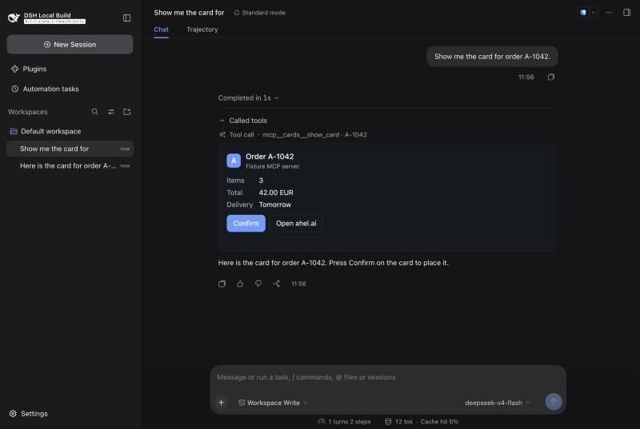
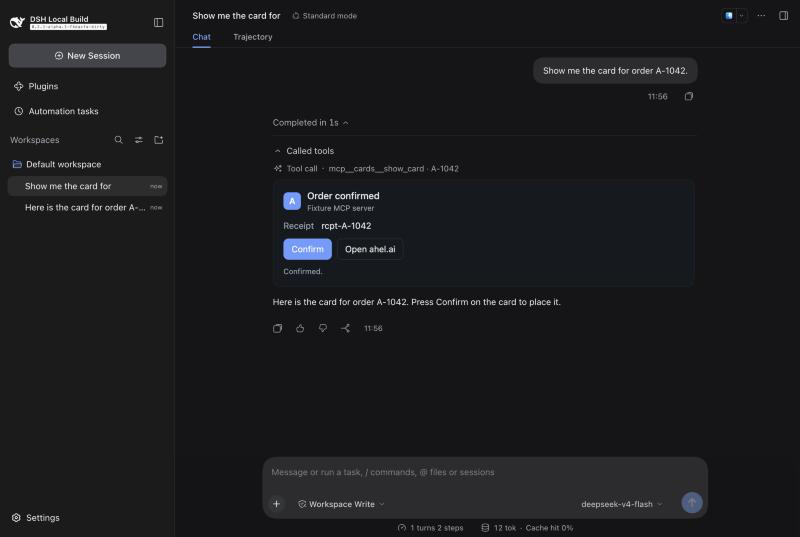

# Ahel Desktop Phase 1B: MCP Apps card renderer

Date: 2026-10-05. Branch: `phase1/card-renderer` (from `spike/phase-0`). Not merged.

Result: MCP Apps cards render in the chat. A fixture MCP server's `ui://` card mounts in a sandboxed frame under its tool call. It receives its tool input and tool result, and its Confirm press runs a second tool on the server through the host. The real Ahel card is wired the same way. Checking it end to end is blocked on Karl's ahel.ai sign-in.



After pressing Confirm (host-proxied `tools/call`, card resized):



## Architecture

```
MCP server ──tools/list (_meta.ui)──▶ mcp-client ──registers──▶ ctx.tools (definition.mcp)
           ──tools/call──────────────▶ mcp-client ──tool/result + meta.mcpApp──▶ session log
                                                                              │
Web client: ui-tool ToolCallTree ── meta.mcpApp? ──▶ slot tool.call.app ──▶ ui-mcp-app card
   card ──Remote mcpApps.readResource──▶ Host McpAppsController ──▶ mcpResources (ui:// cache) ──▶ server
   card ◀──postMessage JSON-RPC──▶ sandboxed iframe (opaque origin, MCP Apps CSP)
   iframe tools/call ──Remote mcpApps.callTool──▶ ctx.tools.execute(agent) ──▶ policy/guards/approval ──▶ server
```

- **mcp-client** (`packages/mcp/mcp-client`):
  - Advertises `extensions["io.modelcontextprotocol/ui"] = { mimeTypes: ["text/html;profile=mcp-app"] }`.
  - Keeps each tool's `_meta` on the registration as `definition.mcp`: server, raw name, `_meta`, and the parsed `ui.resourceUri` and `ui.visibility`. The deprecated flat `ui/resourceUri` is also read.
  - Hides app-only tools from the model.
  - For card tools, persists `result.meta.mcpApp` (v1): server, tool, resourceUri, visibility, `structuredContent`.
  - Result `_meta` (for example Ahel's one-use `ai.ahel/pressToken`) is never persisted: not in the canonical value, the Session log, exports or telemetry. It lives in Host memory keyed by call id (256 per Agent) and the live card reads it through `mcpApps.resultMeta`. After a Host restart the card has no token and the person confirms on ahel.ai.
  - Card `tools/call` and changed `ui/update-model-context` payloads are added as logged `mcp-app` context for the next model turn (arguments omitted). One card action runs at a time; `ui/open-link` needs a user gesture and opens at most one link per 3 s.
  - Structured fields over 256 KiB are dropped, marked `truncated`, and fall back to text.
- **mcp-resources**: `readAppResource(agent, server, uri, signal)` adds a least-recently-used cache, keyed by server provider, connection generation and URI (16 entries by default, config `appResourceCacheEntries`). The URI carries the server's content version (Ahel: `gateway-app-<hash>.html`). Failed reads are not cached.
- **ui-tool**: a new single session slot `tool.call.app`, rendered under the row of a successful call that has `meta.mcpApp`. The row itself is unchanged, so it still holds the expandable text output.
- **ui-mcp-app** (new, `packages/client/ui-mcp-app`):
  - Host `McpAppsController`, Remote namespace `mcpApps`, generated by Typert and self-mounted by the client, the same way as the experimental voice-input package. `packages/api/remotes` is untouched.
  - Client card: loading spinner, frame, fallback, and bridge.

## Spec coverage (MCP Apps 2026-01-26)

| Method / rule | Status | Notes |
|---|---|---|
| Client capability `io.modelcontextprotocol/ui` | implemented | per request `_meta` in the 2026-07-28 era; `initialize` in older eras |
| Tool `_meta.ui.resourceUri` (+ flat `ui/resourceUri`) | implemented | only `ui://` accepted |
| `_meta.ui.visibility` | implemented | not model → hidden from model; not app → `tools/call` from card refused |
| `resources/read` of `ui://` (text or base64 blob, mime check) | implemented | cached per server + generation + URI |
| Resource `_meta.ui.csp` → CSP | implemented | spec policy plus `form-action 'none'`; default policy when absent; unsafe entries dropped |
| Resource `_meta.ui.prefersBorder` | implemented | `false` → no border |
| Resource `_meta.ui.permissions` | missing | no `allow` attribute (camera, mic, geo, clipboard) granted |
| Resource `_meta.ui.domain` / CSP on `resources/list` entry | missing | read-item `_meta` only (Ahel sets both) |
| Sandboxed iframe | partial | single frame, `sandbox="allow-scripts allow-forms"`, no `allow-same-origin`, opaque origin; the spec's double-frame proxy for Web hosts is not built |
| Origin checks | implemented | `event.source === frame.contentWindow` and `origin === "null"`; second `load` (navigation) stops the bridge |
| `ui/initialize` → result (protocolVersion, hostInfo, hostCapabilities, hostContext) | implemented | |
| `ui/notifications/initialized` gating | implemented | host notifications are queued until received |
| `ui/notifications/tool-input` | implemented | sent from the recorded call arguments, before the result |
| `ui/notifications/tool-input-partial` | missing | card mounts after the call settles |
| `ui/notifications/tool-result` | implemented | text content, `structuredContent`, `_meta` |
| `ui/notifications/tool-cancelled` | partial | method exists in the bridge; failed calls render no card, so never sent |
| `ui/notifications/host-context-changed` | implemented | theme (light/dark from the app theme), style variables from design tokens; only changed keys |
| hostContext fields | implemented | theme, displayMode inline, availableDisplayModes, containerDimensions.maxHeight, locale, timeZone, platform, userAgent, styles.variables |
| `ui/notifications/size-changed` | implemented | frame height = min(reported, `maxHeight` 640), taller content scrolls inside |
| `tools/call` from app | implemented | same server only, through `ctx.tools.execute` with the Session Agent |
| `resources/read` from app | implemented | same server |
| `ui/open-link` | implemented | http/https only → `window.open(noopener)`; desktop shell hands it to the system browser |
| `ui/update-model-context` | implemented | changed payloads become logged `mcp-app` context for the next model turn |
| `ui/message` | partial | answered `{ isError: true }` (Ahel treats that as declined) |
| `ui/request-display-mode` | partial | always returns `inline` |
| `ui/resource-teardown` | partial | sent on unmount, not awaited (the frame is removed) |
| `ping`, `notifications/message` | implemented | logging is accepted and ignored |
| `ui/download-file`, `sampling/createMessage`, app-provided tools | missing | method-not-found |

## Deferred (review 2026-10-05)

- Double-frame sandbox proxy with a separate origin (single opaque-origin frame for now).
- Caps on resource size and per-card call rate beyond one-in-flight.
- Loader-booted (real `cordis.yml`) composition test; the fixture flow is the manual equivalent.
- App-only tools (visibility without `model`): dsh's registry cannot register a tool hidden from the model yet still executable, so they stay unbridged.
- Remaining `as` cast nits in the card and record parsers.

## Ahel widget compatibility

Checked against `ahel/widgets/src/ui/host.ts` and `gateway-app.ts`:

- The Ahel card uses `@modelcontextprotocol/ext-apps` `App` 1.7.5. It sends `ui/initialize` with protocol `2026-01-26`, which this host returns.
- It reads `structuredContent`, `content`, `isError`, `_meta` (press token), `theme`, `styles.variables`, and `safeAreaInsets` (not sent).
- It sends `tools/call` for `run_action`, `install`, `switch` and `use`. These carry `ui.visibility: ["model","app"]`, so they are allowed. Read-only tools carry `["model"]` and are refused from the card, as in claude.ai.
- It also sends `ui/update-model-context`, `ui/open-link`, `ui/message` and `size-changed`.
- The 406 KB single-file HTML is inline JS and CSS with empty CSP domain lists, so the default inline rules cover it.
- It waits 150 ms for `window.openai` before `ui/initialize`. This host never defines `window.openai`, so it takes the MCP Apps path.

## Security notes

- **No same-origin.** The app cannot read the host DOM, `localStorage`, cookies or the dsh session token. It cannot open popups or navigate the top window (no `allow-popups` or `allow-top-navigation`). `form-action 'none'` blocks form navigation; `allow-forms` only lets in-page submit handlers run.
- **The CSP is a `<meta>` tag.** It is prepended to `<head>` before any server element, after parsing with `DOMParser`, which runs no scripts. The srcdoc frame also inherits the host page's policy; dsh Web serves none today. A header-delivered CSP needs a separate sandbox origin, which is the spec's proxy design (deferred).
- **Navigation.** After a frame navigation the host stops posting, and the card shows its fallback. Messages already in flight during a navigation can still reach the new page; the double-frame proxy would close this.
- **Approval.** A card's `tools/call` runs through `ctx.tools.execute` with the Agent: `tools/pre-execute` policy, guards, approval `ask`, and `tools/post-execute`. That is the same pipeline as a model call; a test shows a deny policy blocking a card call.
  - dsh mounts no `ask` policy for MCP tools today. Ahel's own confirm design (one-use press token, only the person's press) is the consent, as in claude.ai.
  - An `ask` needs an open turn. Outside a turn it fails closed (denied).
- **Remote calls** are scoped to the Session's Agent, and the card's server is fixed from the persisted record. A card cannot address another server.

## Tests

Command:

```
npx vitest run packages/mcp/mcp-client packages/mcp/mcp-resources packages/client/ui-tool packages/client/ui-mcp-app
```

Result: 35 files, 604 tests, all passed. New tests:

- `packages/mcp/mcp-client/tests/apps.spec.ts` (12): real in-memory SDK server.
  - Capability advertisement.
  - `_meta` on the definition; app-only tools hidden.
  - `meta.mcpApp` with `structuredContent` and press token, with no `_meta` in the value.
  - No meta for plain tools; cached versus uncached reads; scope refusal; `readToolUi` cases; truncation.
- `packages/client/ui-mcp-app/tests/bridge.client.spec.ts` (13): fake frame.
  - Handshake; queued tool-input then tool-result; host-context diffs.
  - `tools/call`, `resources/read`, `open-link` scheme refusal, size-changed.
  - Model context, `ping`, `ui/message`, unknown method, malformed payloads, dispose, teardown.
- `packages/client/ui-mcp-app/tests/card.client.spec.tsx` (8): jsdom.
  - Sandbox attributes and CSP first in the head.
  - Notifications only after `initialized`; foreign windows ignored.
  - Card `tools/call` routed to the card's server; height capped.
  - Link opener; fallback on read failure; truncated record.
- `packages/client/ui-mcp-app/tests/integration.client.spec.tsx` (3): fixture MCP server, real mcp-client connection, resources, tool registry and Host controller, plus the DOM card.
  - The card mounts and the tool-result notification reaches the frame with the press token.
  - A card `tools/call` returns the server's result.
  - A deny policy blocks card calls; refusals for model-only, unknown and other-server tools.
- `packages/client/ui-tool/tests/toolview-slot.client.spec.tsx` (+1): `tool.call.app` renders for a successful `mcpApp` result only, under the row.

Also run:

- `pnpm run build`: green, 357 client artifacts.
- `tsc -b tsconfig.client.json`: green.
- oxlint on the changed packages: clean.
- `verify-translation-pairing` on the 4 READMEs: consistent.

## Manual check (Web)

- Fixture flow, no key or account: `docs/phase1/fixture/run-card-fixture.sh`.
  - `@ahel/dsh-llm-replay` replays `card-fixture.session.v4.jsonl` as the model. It calls `mcp__cards__show_card` and then answers.
  - The stdio fixture server `packages/client/ui-mcp-app/tests/fixtures/cards-server.mjs` serves the tool and a dependency-free MCP Apps card.
  - Send any prompt and expand "Called tools". The screenshots above come from this flow.
- Ahel: `docs/phase1/fixture/run-ahel-signin.sh` mounts `https://mcp.ahel.ai/mcp` with the spike OAuth row plus the card host, and prints the ahel.ai sign-in URL. Reached on 2026-10-05.
  - It reused the spike's stored client registration, so no new registration was created on ahel.ai.
  - **Nobody signed in.** The real Ahel card check is blocked on Karl's sign-in.

## What the real Ahel card still needs

1. Karl signs in: run `run-ahel-signin.sh`, open the URL, approve. The token lands in that `DSH_HOME/mcp-oauth/ahel.json`.
2. A model to call Ahel tools. Per Karl, no DeepSeek key; the Phase 2 model path (BYO Claude/OpenAI key or Ahel-metered) is required. Until then, a replay script that calls `mcp__ahel__explore` or `installed` can drive it the same way as the fixture.
3. Forward `ui/update-model-context` into the next request, as a logged session event. Ahel pushes each card step to the model.
4. Optional: `safeAreaInsets`, the double-frame sandbox proxy, and `ui/message` follow-up turns.

## Merging with phase1/strip-rebrand

Files outside this agent's path list that the branch touches, each small:

- `tsconfig.host.json` and `tsconfig.client.json`: one reference row each, after `file-upload`.
- `pnpm-lock.yaml`: the new workspace package.
- `docs/phase1/**`: new.
- `packages/api/remotes` is **not** touched; the client mounts its own Remote contribution.

The one bundle row, once the other branch owns the bundle: add it to `packages/bundle/web-app/cordis.patch.yml`, next to `ui-tool`. It is also in `docs/phase1/ui-mcp-app.cordis.patch.yml`:

```yaml
    - id: ui-mcp-app
      name: '@ahel/dsh-client-ui-mcp-app'
```

Add `"@ahel/dsh-client-ui-mcp-app": "workspace:*"` to the dependencies of `packages/bundle/web-app/package.json`, or of the Ahel bundle that replaces it. Without that entry, the Loader cannot resolve the bare name ("failed to import"). Until then, dev runs use `docs/phase1/fixture/ui-mcp-app.dev.cordis.patch.yml`, which names the built entry by path.

The desktop shell already sends `window.open` http(s) URLs to `shell.openExternal`, so no `apps/desktop` change is needed. The client bundle inlines zod from the generated Typert codecs (about 200 KB), the same as other self-mounted Remotes.
